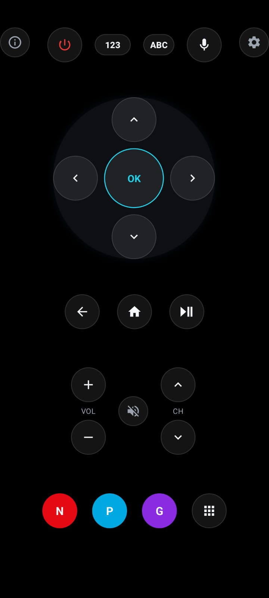
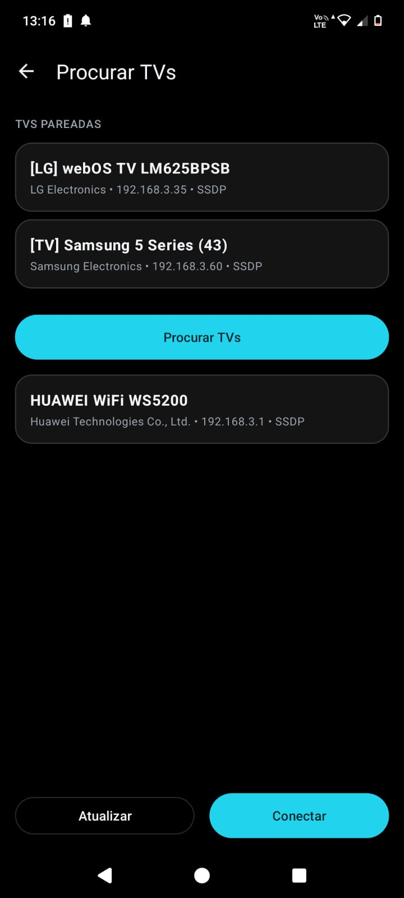
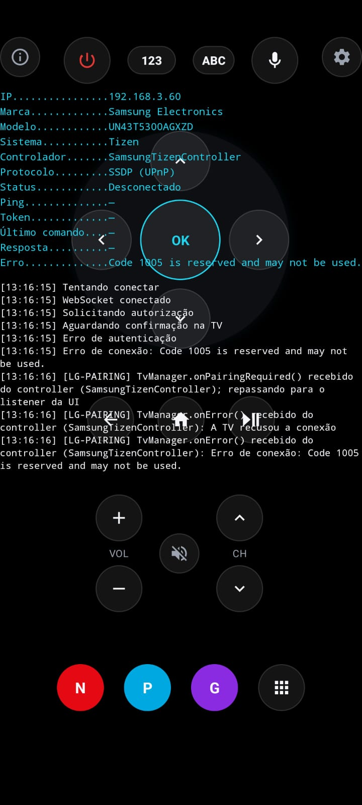

# Smart Remote

[](./LICENSE)

Controle remoto universal para Smart TVs, escrito em Kotlin nativo (Android
View system, sem Compose/MVVM/DI) — descobre TVs na rede local, pareia, e
controla via WebSocket, com uma tela de diagnóstico embutida para depurar
conexão e comandos em tempo real.

## Screenshots

<table>
  <tr>
    <td align="center" width="25%">
      
      <br/><sub>Controle remoto</sub>
    </td>
    <td align="center" width="25%">
      
      <br/><sub>Descoberta de TVs</sub>
    </td>
    <td align="center" width="25%">
      
      <br/><sub>Painel de diagnóstico</sub>
    </td>
    
  </tr>
</table>

> **v0.8** — fase de correção de arquitetura e robustez (bugs reais da
> camada de Discovery, testes automatizados, CI, acessibilidade), sobre a
> base da v0.7 (evolução completa da camada de descoberta de dispositivos —
> múltiplos protocolos, deduplicação inteligente, diagnóstico estruturado).
> Sem mudança de comportamento observável em relação à v0.7. Veja
> [Descoberta de TVs](#descoberta-de-tvs) para detalhes da descoberta.

## Funcionalidades

- **Controle remoto completo**: d-pad, power, volume, canal, mute,
  play/pause, back, home, teclado numérico e alfabético.
- **Entrada de texto por voz**: usa o reconhecimento de fala nativo do
  Android e envia o texto reconhecido para a TV (mesmo caminho do teclado
  digitado).
- **Atalhos de streaming**: Netflix, Prime Video, Globoplay direto na tela
  principal, mais uma grade de apps (Disney+, Max, YouTube, Apple TV+,
  Paramount+, Crunchyroll, Plex) que se adapta ao que a TV conectada
  realmente suporta.
- **Descoberta e pareamento de TVs** na rede local (SSDP/UPnP + mDNS +
  confirmação via API nativa da Samsung), com feedback claro de status
  (Conectando.../Pareando.../Conectada).
- **Múltiplas TVs pareadas simultaneamente** — troca de TV ativa sem perder
  o pareamento das demais; reconexão automática, ao abrir o app, sempre com
  a última TV efetivamente usada (não a primeira pareada).
- **Painel de diagnóstico** embutido (acessível pelo botão de informação):
  mostra IP, marca, modelo, sistema, protocolo, status, ping, token
  (mascarado) e um log cronológico de eventos de conexão — útil tanto para
  o usuário final entender por que uma TV não conecta quanto para
  desenvolvimento.

## TVs suportadas

| Fabricante | Sistema | Status |
|---|---|---|
| Samsung | Tizen | ✅ Controle via WebSocket (`SamsungTizenController`) |
| LG | webOS | ✅ Controle via WebSocket/SSAP (`LgWebOsController`) |
| Sony/TCL/Philips/Hisense | Android TV / Google TV | 🔜 Planejado |
| Amazon | Fire OS | 🔜 Planejado |
| Roku | Roku OS | 🔜 Planejado |
| Hisense | VIDAA | 🔜 Planejado |

A **descoberta** já reconhece TVs desses fabricantes na rede (via
SSDP/mDNS), mesmo que o **controle** ainda não esteja implementado — nesse
caso, o app mostra a TV na lista, mas ao tentar conectar informa "TV ainda
não suportada nesta versão".

## Descoberta de TVs

A partir da v0.7, a descoberta deixou de depender de um único método
(`SSDP` com um Search Target fixo) e passou a ser um pipeline de scanners
independentes:

```
DeviceDiscoveryActivity
        │
        ▼
   DeviceScanner                 (orquestrador)
        │
        ├── DiscoveryCache            (estado temporário da busca atual)
        │      └── DiscoveryAggregator (dedup / merge / confidence)
        │
        ├── SsdpScanner    — M-SEARCH com múltiplos Search Targets
        │                    (ssdp:all, DIAL, UDAP da LG, MediaRenderer, ECP da Roku)
        ├── MdnsScanner    — Chromecast, Android TV Remote, DIAL, AirPlay, webOS
        └── SamsungDiscoveryScanner
                            — confirma candidatos via API HTTP nativa da
                              Samsung (`:8001/api/v2/`), identificando a TV
                              mesmo quando o SSDP falha
```

A deduplicação usa uma prioridade de identidade (`UUID → deviceId → MAC →
nome+modelo → IP`) com pontuação de confiança, para que um resultado mais
completo sempre substitua um genérico — sem nunca duplicar ou esconder uma
TV da lista. Cada scanner registra seu próprio ciclo de vida
(`DiscoveryDiagnostics`), permitindo rastrear exatamente onde e por que uma
TV específica não foi encontrada.

A arquitetura foi desenhada para que suportar um fabricante novo (LG,
Android TV, Roku, Fire TV, VIDAA) seja só criar um scanner que implemente
`DiscoveryScanner` e registrá-lo — sem alterar o restante do pipeline nem a
UI.

## Como funciona (visão geral da arquitetura)

```
app/src/main/java/com/example/smartremote/
├── discovery/     Descoberta de TVs na rede (SSDP, mDNS, confirmação por
│                   fabricante) + UI de busca/pareamento
├── manager/        TvManager (fachada única da UI para TVs pareadas/
│                   conectadas) + ConnectionManager (estado da conexão ativa)
├── controller/     Um TvController por fabricante (Samsung/Tizen, LG/webOS),
│                   cada um isolado no próprio protocolo de rede
├── model/          TvDevice, RemoteKey, enums de protocolo/SO
├── util/           Constants, DeviceStorage (persistência), CredentialStore
│                   (tokens de pareamento), NetworkUtils
├── diagnostic/      DiagnosticManager — estado/log de conexão exibido no
│                   painel de diagnóstico da tela principal
└── ui/             BottomSheets (teclado, texto, apps) da tela principal
```

Princípios que o projeto segue (e que qualquer contribuição deve manter):

- **Um `TvController` por fabricante**, isolado no próprio protocolo — a UI
  e o `TvManager` nunca sabem como cada marca fala com sua TV.
- **`TvManager` é o único ponto de acesso da UI** às TVs pareadas e à
  conexão ativa — decide qual `TvController` usar com base no
  `TvOperatingSystem` detectado na descoberta.
- **Três conceitos que nunca se misturam**: TVs *descobertas* (temporárias,
  recriadas a cada busca), TVs *salvas* (persistentes, podem ser várias) e
  TV *conectada* (uma só, por vez).
- **`TvDevice.stableKey()`** é a identidade de pareamento/credenciais — não
  depende do IP (que muda com renovação de DHCP), e é diferente da
  identidade multi-critério usada só durante a descoberta.

## Requisitos

- Android Studio (versão compatível com AGP 9.2.1 / compileSdk 37.0).
- Dispositivo/emulador com **minSdk 26** (Android 8.0+).
- TV e celular na **mesma rede Wi-Fi** — a descoberta é feita por multicast
  na rede local (SSDP/mDNS), então não funciona entre redes diferentes ou
  com isolamento de cliente (AP/client isolation) habilitado no roteador.

## Como rodar

```bash
git clone https://github.com/brunoCodds/smartremote.git
cd smartremote
./gradlew assembleDebug
```

Ou abra a pasta no Android Studio e rode normalmente (`Run ▶`).

## Testes e CI

```bash
./gradlew test          # testes unitários (JUnit, sem framework de mock)
./gradlew assembleDebug  # build de debug
```

O GitHub Actions (`.github/workflows/ci.yml`) roda os dois comandos acima
em todo push/PR para `main`. Cobertura atual de testes unitários:

- `DiscoveryAggregator` — dedup por UUID/deviceId/MAC/nome+modelo/IP, regra
  de merge por confidence, e preservação de campos no merge.
- `DeviceIdentity` — extração de UUID e normalização de MAC (incluindo o
  placeholder `"none"` da API Samsung).
- `DiscoveryConfidence` — pontuação de completude e detecção de nome
  genérico.
- `TvDevice.stableKey()` — proteção contra regressão do algoritmo de
  identidade de pareamento (ver a seção de arquitetura acima para por que
  isso é crítico).

## Build de release assinado

Nenhuma keystore é commitada neste repositório (nem deveria ser). Para
gerar um build de release assinado localmente:

1. Gere sua própria keystore:
   ```bash
   keytool -genkey -v -keystore smartremote-release.jks \
     -keyalg RSA -keysize 2048 -validity 10000 -alias smartremote
   ```
2. Crie (ou edite) o `local.properties` na raiz do projeto — já ignorado
   pelo `.gitignore`, nunca commitar — com:
   ```properties
   RELEASE_STORE_FILE=/caminho/para/smartremote-release.jks
   RELEASE_STORE_PASSWORD=...
   RELEASE_KEY_ALIAS=smartremote
   RELEASE_KEY_PASSWORD=...
   ```
   (as mesmas 4 chaves também podem vir de variáveis de ambiente, útil em CI).
3. Rode `./gradlew assembleRelease` normalmente — o `signingConfig` só é
   aplicado quando as 4 propriedades acima existem; sem elas, o build de
   release continua funcionando (só sai sem assinatura).

O release também já roda com R8/minificação ligados
(`app/src/main/keepRules/rules.keep` tem as regras de proteção). Como o
projeto está na AGP 9.2.1 (o DSL `optimization { enable = true }` só vira
comportamento padrão a partir da AGP 9.3), isso exige a flag
`android.r8.gradual.support=true` em `gradle.properties` - já incluída
neste repositório.

## Stack

- **Kotlin** puro, sem Compose — Android Views + ViewBinding.
- **OkHttp** para WebSocket com as TVs.
- **RecyclerView + Material Components** para as listas/bottom sheets.
- Persistência simples via `SharedPreferences` + JSON nativo
  (`org.json`) — sem Room/DataStore.
- Sem MVVM, Repository, DI, LiveData ou Flow — arquitetura deliberadamente
  simples, organizada por responsabilidade de pacote.

## Roadmap

- [ ] Scanners de descoberta "do zero" para LG, Android TV, Roku, Fire TV
      e VIDAA (a arquitetura de Discovery já está pronta para recebê-los).
- [ ] Suporte de **controle** (não só descoberta) para os fabricantes acima.
- [ ] Lançamento de apps de streaming via protocolo nativo de cada
      fabricante (hoje `supportedApps()` já existe por `TvController`, mas
      poucos apps têm App ID confiável mapeado).
- [ ] Listener passivo de `NOTIFY ssdp:alive` (captura TVs que ligam durante
      a janela de busca).
- [ ] Varredura de sub-rede por porta conhecida como fallback manual
      explícito, para redes com multicast bloqueado.

## Licença

Este projeto está licenciado sob a **GNU General Public License v3.0**
(GPL-3.0) — veja o arquivo [`LICENSE`](./LICENSE) para o texto completo e
oficial.

**O que isso significa na prática:**

- Qualquer pessoa é livre para usar, estudar, modificar e redistribuir
  este código — **inclusive comercialmente** — desde que mantenha a mesma
  licença (GPL-3.0) e disponibilize o código-fonte correspondente (o seu
  próprio ou o modificado) a quem receber o software.
- **Uso comercial:** a GPL-3.0 permite explicitamente vender, cobrar ou
  distribuir comercialmente o software. O que ela não permite é fechar o
  código: se você redistribuir (gratuitamente ou não), precisa manter a
  GPL e fornecer o código-fonte sob os mesmos termos.
- **Quer usar de forma fechada/proprietária?** Se a sua empresa quer
  incorporar este código num produto sem as obrigações da GPL (sem
  precisar abrir o código-fonte do que for construído em cima), **entre
  em contato** para discutirmos uma licença comercial separada. Isso é
  **só um convite**, não uma exigência adicional da GPL — você já pode
  usar o software comercialmente sem falar comigo, contanto que respeite
  a GPL normalmente.
- Contato: abra uma
  [issue](https://github.com/brunoCodds/smartremote/issues) ou procure
  brunoCodds no GitHub.

> Esta licença se aplica a todo o histórico do projeto — versões
> anteriores (incluindo v0.7 e v0.8, que não continham um arquivo
> `LICENSE` explícito) também são consideradas licenciadas sob GPL-3.0
> por esta declaração, assim como todas as versões futuras — sem
> necessidade de reescrever tags/commits antigos já publicados.

Copyright © 2026 brunoCodds.
