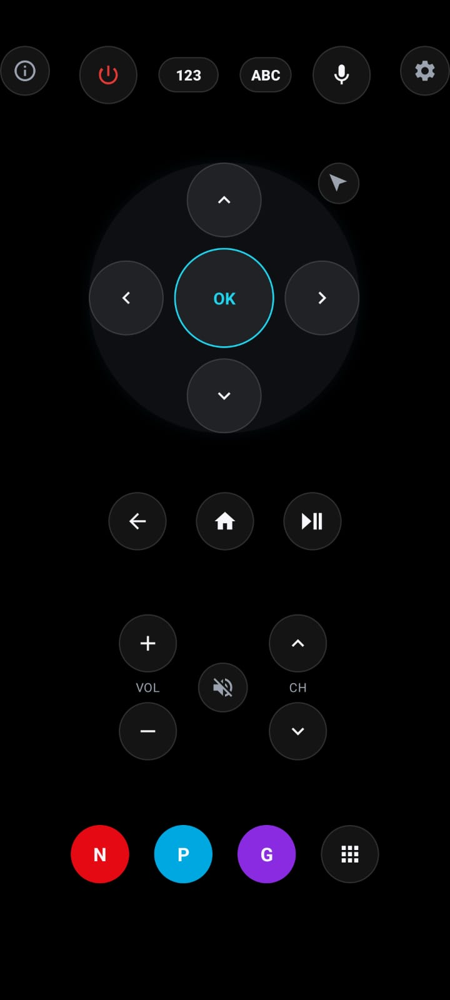
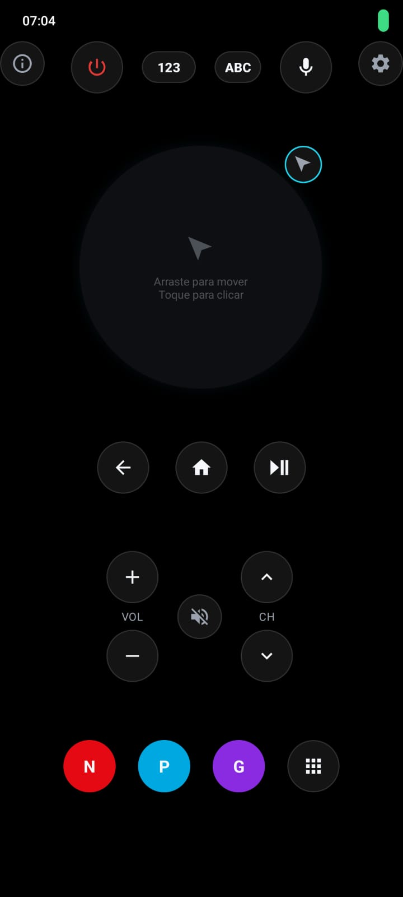
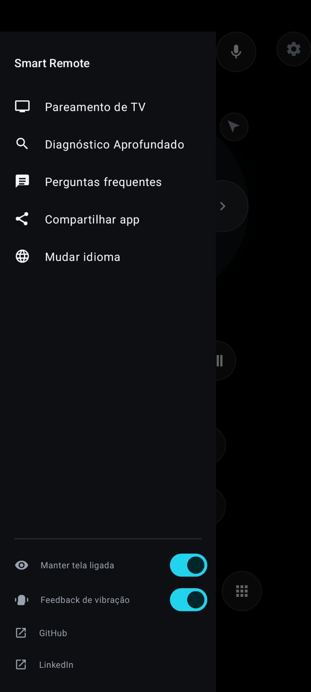

# Smart Remote

[](./LICENSE)

[](https://www.linkedin.com/in/bruno-ot%C3%A1vio-silva-de-oliveira-865930332/)

Controle remoto universal para Smart TVs, escrito em Kotlin nativo (Android
View system, sem Compose/MVVM/DI) — descobre TVs na rede local, pareia, e
controla via WebSocket, com um painel de diagnóstico simples embutido e uma
tela de diagnóstico aprofundado para depurar conexão e comandos em tempo
real.

Uso este app diariamente para controlar minha TV desde a v0.7 — meu
controle remoto físico quebrou, então esse é o app que eu realmente uso no
dia a dia, não um protótipo de estudo.

## Screenshots

<table>
  <tr>
    <td align="center" width="25%">
      
      <br/><sub>Controle remoto + adições novas</sub>
    </td>
    <td align="center" width="25%">
      
      <br/><sub>Menu principla com o modo cursor ativo</sub>
    </td>
    <td align="center" width="25%">
      
      <br/><sub>Painel lateral</sub>
    </td>
  </tr>
</table>


> **v0.9.4.2** — Botão de manter tela ligada — ligado por padrão, não disliga a tela do app.
>
>Botão de feedback de vibração — liga/desliga geral, ligado por padrão, ele quando ativo faz os botões do controle terem vibração tatica

## Funcionalidades

- **Controle remoto completo**: d-pad, power, volume, canal, mute,
  play/pause, back, home, teclado numérico e alfabético.
- **Entrada de texto por voz**: usa o reconhecimento de fala nativo do
  Android e envia o texto reconhecido para a TV (mesmo caminho do teclado
  digitado).
- **Atalhos de streaming**: Netflix, Prime Video, Globoplay direto na tela
  principal, mais uma grade de apps (Disney+, Max, YouTube, Apple TV+,
  Paramount+, Crunchyroll, Plex) que se adapta ao que a TV conectada
  realmente suporta.
- **Descoberta e pareamento de TVs** na rede local (SSDP/UPnP + mDNS +
  confirmação via API nativa da Samsung), com feedback claro de status
  (Conectando.../Pareando.../Conectada).
- **Reconexão automática**: detecta quedas de conexão não pedidas pelo
  usuário e tenta reconectar sozinho, com backoff (não agressivo),
  reagindo tanto a voltar para o app quanto a mudanças de rede
  (Wi-Fi caiu e voltou) — sem nunca "spammar" popups de pareamento na TV
  quando a tentativa é silenciosa/automática. Um indicador discreto
  ("Reconectando a *Nome da TV*...") aparece na tela principal enquanto
  isso acontece (v0.9.3).
- **Múltiplas TVs pareadas simultaneamente** — troca de TV ativa sem perder
  o pareamento das demais; reconexão automática, ao abrir o app, sempre com
  a última TV efetivamente usada (não a primeira pareada).
- **Painel de diagnóstico simples** (acessível pelo botão de informação),
  pensado para o usuário final, não para depuração de protocolo: nome da
  TV, status da conexão, último erro (se houver) e ping até a TV.
- **Menu lateral** (v0.9.3): pareamento de TV, Diagnóstico Aprofundado,
  perguntas frequentes, compartilhar o app, e troca de idioma — persistida
  entre aberturas do app.
- **Diagnóstico Aprofundado** (v0.9.3): tela própria, separada do painel
  simples, com o dado técnico cru e completo — todos os campos de estado
  da conexão, o log cronológico e colorido de eventos de conexão, e o log
  da última busca de TVs (por que uma TV específica não foi encontrada).
  Útil tanto para desenvolvimento quanto para um usuário avançado
  investigar um problema específico.
- **Português, inglês, espanhol e francês** (v0.9.3) — trocável a qualquer
  momento pelo menu lateral, sem precisar mudar o idioma do sistema.

## TVs suportadas

| Fabricante | Sistema | Status |
|---|---|---|
| Samsung | Tizen | ✅ Controle via WebSocket (`SamsungTizenController`) |
| LG | webOS | ✅ Controle via WebSocket/SSAP (`LgWebOsController`) |
| Sony/TCL/Philips/Hisense | Android TV / Google TV | ✅ Controle via Protobuf/TLS mútuo (`AndroidTvController`) |
| Amazon | Fire OS | 🔜 Planejado |
| Roku | Roku OS | 🔜 Planejado |
| Hisense | VIDAA | 🔜 Planejado |

A **descoberta** já reconhece TVs desses fabricantes na rede (via
SSDP/mDNS), mesmo que o **controle** ainda não esteja implementado — nesse
caso, o app mostra a TV na lista, mas ao tentar conectar informa "TV ainda
não suportada nesta versão".

## Descoberta de TVs

A partir da v0.7, a descoberta deixou de depender de um único método
(`SSDP` com um Search Target fixo) e passou a ser um pipeline de scanners
independentes:

```
DeviceDiscoveryActivity
        │
        ▼
   DeviceScanner                 (orquestrador)
        │
        ├── DiscoveryCache            (estado temporário da busca atual)
        │      └── DiscoveryAggregator (dedup / merge / confidence)
        │
        ├── SsdpScanner    — M-SEARCH com múltiplos Search Targets
        │                    (ssdp:all, DIAL, UDAP da LG, MediaRenderer, ECP da Roku)
        ├── MdnsScanner    — Chromecast, Android TV Remote, DIAL, AirPlay, webOS
        └── SamsungDiscoveryScanner
                            — confirma candidatos via API HTTP nativa da
                              Samsung (`:8001/api/v2/`), identificando a TV
                              mesmo quando o SSDP falha
```

A deduplicação usa uma prioridade de identidade (`UUID → deviceId → MAC →
nome+modelo → IP`) com pontuação de confiança, para que um resultado mais
completo sempre substitua um genérico — sem nunca duplicar ou esconder uma
TV da lista. Cada scanner registra seu próprio ciclo de vida
(`DiscoveryDiagnostics`), permitindo rastrear exatamente onde e por que uma
TV específica não foi encontrada — hoje visível diretamente no app, na
seção "Log de eventos (última busca)" do Diagnóstico Aprofundado (v0.9.3),
sem precisar abrir o Logcat.

A arquitetura foi desenhada para que suportar um fabricante novo (Roku,
Fire TV, VIDAA) seja só criar um scanner que implemente `DiscoveryScanner`
e registrá-lo — sem alterar o restante do pipeline nem a UI.

## Como funciona (visão geral da arquitetura)

```
app/src/main/java/com/example/smartremote/
├── discovery/      Descoberta de TVs na rede (SSDP, mDNS, confirmação por
│                    fabricante) + UI de busca/pareamento + adapter dos
│                    eventos de descoberta no Diagnóstico Aprofundado
├── manager/         TvManager (fachada única da UI para TVs pareadas/
│                    conectadas) + ConnectionManager (estado da conexão
│                    ativa) + ReconnectionManager (backoff/retry
│                    automático) + PingMonitor (latência até a TV, v0.9.3)
├── controller/      Um TvController por fabricante (Samsung/Tizen, LG/webOS,
│                    Android TV/Google TV), cada um isolado no próprio
│                    protocolo de rede
├── model/           TvDevice, RemoteKey, enums de protocolo/SO
├── util/            Constants, DeviceStorage (persistência), CredentialStore
│                    (tokens de pareamento), NetworkUtils, LanguageManager
│                    (troca/persistência de idioma, v0.9.3)
├── diagnostic/       DiagnosticManager (estado/log de conexão) +
│                    DiagnosticLogAdapter (log colorido por tipo) +
│                    DeepDiagnosticActivity (tela de dado técnico cru,
│                    v0.9.3)
├── faq/             Tela de perguntas frequentes (v0.9.3)
├── ui/              BottomSheets (teclado, texto, apps) da tela principal
└── SmartRemoteApplication.kt
                     Único propósito: reaplicar o idioma salvo antes de
                     qualquer Activity abrir (v0.9.3)
```

Princípios que o projeto segue (e que qualquer contribuição deve manter):

- **Um `TvController` por fabricante**, isolado no próprio protocolo — a UI
  e o `TvManager` nunca sabem como cada marca fala com sua TV.
- **`TvManager` é o único ponto de acesso da UI** às TVs pareadas e à
  conexão ativa — decide qual `TvController` usar com base no
  `TvOperatingSystem` detectado na descoberta, e é o único ponto por onde
  toda tecla enviada passa (o que também o torna o lugar certo para
  instrumentação central, como `DiagnosticManager.setLastCommand()` desde
  a v0.9.3 — ver "Novidades da v0.9.3").
- **Três conceitos que nunca se misturam**: TVs *descobertas* (temporárias,
  recriadas a cada busca), TVs *salvas* (persistentes, podem ser várias) e
  TV *conectada* (uma só, por vez).
- **`TvDevice.stableKey()`** é a identidade de pareamento/credenciais — não
  depende do IP (que muda com renovação de DHCP), e é diferente da
  identidade multi-critério usada só durante a descoberta.
- **Painel simples vs. Diagnóstico Aprofundado** (v0.9.3): o painel
  acessível pelo botão de informação na tela principal é para o usuário
  final ("minha TV está funcionando?") — nunca deve crescer para incluir
  jargão técnico de protocolo. Qualquer dado cru (IP, nomes de mensagem de
  protocolo, passos numerados de um fluxo de pareamento, log completo de
  eventos) pertence ao Diagnóstico Aprofundado, tela separada e acessível
  pelo menu lateral.

## Novidades da v0.9.5

### 1. Configurações de auxílio ao usuário (no rodapé do drawer)

Dois toggles novos no menu lateral, logo acima dos links de GitHub/LinkedIn
— não uma tela de Configurações completa (essa fica pra mais pra frente,
quando tiver itens de verdade, tipo tamanho/posição dos botões e
permissões):

- **Manter tela ligada** (`FLAG_KEEP_SCREEN_ON`) — ligado por padrão, já
  que é o esperado de um app de controle remoto usado ativamente não
  deixar a tela apagar sozinha no meio do uso.
- **Feedback de vibração** — liga/desliga geral, ligado por padrão (mesmo
  comportamento que o app já tinha antes deste toggle existir). Passa a
  ser o único ponto de saída de toda vibração do app
  (`MainActivity.triggerHapticFeedback`), então desligar aqui desliga em
  todo lugar de uma vez.

Os dois persistem em SharedPreferences (mesmo padrão já usado por
`LanguageManager`) e o clique é na linha inteira, não fecha o drawer -
dá pra mexer nos dois em sequência sem reabrir o menu.

### 2. Vibração ao entrar no modo cursor

Uma vibração curta agora acontece ao ATIVAR o modo cursor (não durante o
arrasto, nem ao sair dele) - decisão consciente: vibração contínua
durante um gesto de arrastar tende a incomodar mais do que ajudar, e
vibrar ao sair competiria com a vibração do próprio clique dentro do modo
cursor.

## Novidades da v0.9.4.2

### 1. Correção do play/pause (toggle real)

O botão físico único de play/pause enviava sempre o mesmo código
discreto (`KEY_PAUSE` na Samsung, `PAUSE` na LG) — funcionava numa
direção e não na outra, então em algum momento o botão parava de
responder de forma útil (dependendo do estado real de reprodução da TV).

Como nenhum dos dois protocolos tem um botão de toggle nativo (só
`PLAY`/`PAUSE` discretos - Android TV é diferente, já usa um key code de
toggle real do próprio Android e não foi afetado), a correção mantém um
estado local (`mediaIsPlaying`) em `SamsungTizenController` e
`LgWebOsController`, alternado a cada toque, decidindo dinamicamente se
o próximo comando é `PLAY` ou `PAUSE`.

**Limitação conhecida e intencional**: como os dois protocolos são
fire-and-forget, não existe como consultar o estado real de reprodução
da TV - esse `mediaIsPlaying` é só um palpite mantido pelo app, resetado
a cada nova conexão (assume que algo já está tocando). Se o estado real
mudar por fora do app (o vídeo termina sozinho, ou o usuário pausa com o
controle físico da TV), o palpite fica desalinhado até o próximo toque -
não tem como o app saber disso sem um canal de feedback que o protocolo
não oferece.

### 2. Investigação de App IDs faltantes (sem mudança de código)

Pesquisa dedicada aos App IDs que faltavam no Roadmap
(Paramount+/Crunchyroll na LG, Crunchyroll na Samsung):

- **LG webOS**: nenhuma fonte confiável encontrada para nenhum dos três
  (Paramount+, Crunchyroll, Globoplay), mesma conclusão já documentada
  anteriormente - continuam de fora.
- **Samsung (Crunchyroll)**: o app existe oficialmente na Samsung Smart
  TV desde fev/2024, mas o ID numérico usado pelo mecanismo de
  lançamento (`ms.channel.emit`) continua sem fonte confiável - nem
  projetos comunitários bem mantidos têm esse dado (issue aberta sem
  resposta desde a mesma época). O único candidato encontrado
  (`com.crunchyroll.crunchyroid`, identificador da Galaxy Store) é de um
  namespace diferente do usado pelos demais IDs numéricos já cadastrados
  - decisão consciente de não adicionar um ID de baixa confiança.

## Novidades da v0.9.4

### 1. Modo cursor/mouse

Um novo botão (ícone de seta, canto superior direito do D-pad) alterna
entre a navegação por D-pad tradicional e um **modo cursor**: a mesma
área da tela vira uma superfície de toque — arrastar o dedo move um
cursor na tela da TV (delta relativo, escalado por um fator de
sensibilidade empírico), e um toque curto equivale a um clique esquerdo.
Não é um recurso novo do lado da TV — a maioria das Smart TVs já suporta
isso nativamente quando um controle físico ou mouse USB/Bluetooth é
conectado; o app só está expondo esse recurso já existente.

O botão de alternância só fica habilitado quando a TV atualmente
conectada suporta cursor (`TvController.supportsCursorMode()`, novo na
interface, default `false`) — nunca aparece clicável e falha
silenciosamente ao tocar, mesmo critério já usado para apps de streaming
sem App ID confirmado. Esse estado é reavaliado a cada atualização de
diagnóstico, então trocar de TV em tempo de execução (sem fechar o app)
atualiza o botão corretamente, inclusive forçando a volta ao D-pad se o
modo cursor estava ativo numa TV que deixou de estar conectada.

**Suporte por fabricante:**

- **LG webOS**: reaproveita o pointer input socket que já existia só para
  os botões de navegação — os mesmos tipos de mensagem em texto plano
  (`type:move`/`type:click`), sem abrir nenhuma conexão nova.
- **Samsung Tizen**: novo para este fabricante, via o mesmo WebSocket
  principal já usado pelas teclas (`ms.remote.control`, trocando
  `TypeOfRemote` para `ProcessMouseDevice`). **Atenção**: o formato exato
  do campo `Position` (`x`/`y`) não vem de uma fonte oficial — foi
  implementado como delta relativo (mesmo espírito do LG), mas o nome do
  campo sugere posição absoluta. Se o cursor "pular" para um ponto fixo
  em vez de seguir o dedo numa TV Samsung real, é sinal de que essa
  suposição estava errada (ver comentário em
  `SamsungProtocol.buildCursorMoveCommand` para o raciocínio completo).
- **Android TV/Google TV**: **não suportado nesta versão** — o protocolo
  "Android TV Remote Service v2" usado pelo app não documenta nenhum tipo
  de mensagem de ponteiro/touchpad (só tecla, IME, launch de app e voz).
  O botão de alternância fica desabilitado quando essa é a TV conectada.

Os eventos de movimento **não** passam pelo log cronológico do
Diagnóstico Aprofundado nem por `DiagnosticManager.setLastCommand()` — um
gesto de arrastar gera um evento a cada ~20ms (throttle), e logar cada um
encheria o log (limite de 100 entradas) em segundos, sem nenhum valor de
depuração adicional. O clique do cursor, por ser um evento discreto como
uma tecla, continua sendo logado normalmente.

### 2. Suavização do movimento do cursor (correção pós-lançamento)

Após o lançamento inicial do modo cursor, veio feedback de que o
movimento estava travando em alguns momentos — mais perceptível com apps
pesados abertos na TV (YouTube, Netflix). Três ajustes no
`MainActivity.handleCursorTouch()`:

- **Throttle reduzido de 40ms para 20ms**: o mesmo movimento total passou
  a ser mandado em pacotes menores e mais frequentes, em vez de saltos
  grandes e espaçados — mais fácil de uma TV sob carga processar/renderizar
  de forma fluida.
- **Pontos históricos do gesto passaram a ser processados**
  (`MotionEvent.getHistoricalX`/`getHistoricalY`): o Android agrupa vários
  toques físicos num único `MotionEvent` quando o sistema está ocupado -
  sem isso, os pontos intermediários do gesto eram descartados e o
  movimento parecia "pular" em vez de deslizar. Isso também exigiu trocar
  `event.rawX`/`rawY` por `event.x`/`y` (coordenada local) em todo o
  método, já que pontos históricos só existem em coordenada local.
- **Correção de um bug de arredondamento**: o delta acumulado, depois de
  multiplicado pela sensibilidade e convertido pra `Int`, tinha sua parte
  fracionária simplesmente descartada a cada envio em vez de guardada para
  a próxima leva. Em arrastos lentos, isso fazia pequenos movimentos nunca
  acumularem o suficiente para virar 1 pixel inteiro - o cursor "grudava".

**Importante**: se o travamento persistir especificamente dentro de apps
como YouTube/Netflix (e não, por exemplo, na tela inicial da TV), é sinal
de que a causa é a própria TV sob carga de CPU/GPU decodificando vídeo,
atrasando o processamento das mensagens do pointer socket (LG) ou
WebSocket (Samsung) - isso está fora do que o app consegue controlar do
lado do cliente.

## Novidades da v0.9.3

### 1. Indicador de reconexão automática

Um indicador discreto ("Reconectando a *Samsung Q60*...", com ícone
girando) aparece na parte inferior da tela principal enquanto uma
reconexão automática está em andamento — tanto durante o aguardo do
backoff quanto durante a tentativa proativa ao voltar para o app. Usa um
campo dedicado (`DiagnosticState.isAutoReconnecting`), separado do texto
de `connectionStatus`, porque esse texto já é reaproveitado por outro
fluxo (reabertura do socket logo após aceitar um pareamento manual na
Samsung) — misturar os dois faria o indicador aparecer errado durante um
pareamento novo.

### 2. Painel de diagnóstico simples reformulado

Passou por duas rodadas de simplificação a partir do feedback de uso real:

- Os campos técnicos (IP, protocolo, nome da classe do controller, token)
  saíram do painel simples — continuam disponíveis por inteiro no
  Diagnóstico Aprofundado.
- "Último comando" e "Resposta" também saíram — são nomes técnicos de
  protocolo (`KEY_HOME`, `KEY_VOLUP` etc.) sem valor para quem só quer
  saber se a TV está funcionando, e ocupavam espaço de tela à toa.
- O stream de log cronológico (que mostrava passos técnicos como
  `[LG-PAIRING] 3/6`) foi removido inteiramente do painel simples — hoje é
  exclusivo do Diagnóstico Aprofundado.

O que sobrou é só o essencial: **Nome da TV**, **Status**, **Erro** (se
houver) e **Ping**.

Dois bugs de dados foram corrigidos no processo:

- **"Último comando" nunca aparecia para TVs LG** — `LgWebOsController`
  nunca chamava `DiagnosticManager.setLastCommand()` no caminho comum de
  teclas do controle remoto. Corrigido centralizando essa chamada em
  `TvManager.sendRemoteKey()`/`sendText()`, único ponto por onde toda
  tecla passa, independente de fabricante.
- **"Ping" nunca era medido por nenhum fabricante** — o método já existia
  em `DiagnosticManager`, mas nada o chamava. Criado `PingMonitor`, que
  mede o tempo de conexão TCP até a porta de controle da TV a cada 10s
  enquanto conectado (proxy honesta de latência, já que ICMP ping real não
  é viável no Android sem root).

### 3. Menu lateral, FAQ e troca de idioma

O botão de engrenagem, que antes ia direto para a tela de descoberta,
agora abre um menu lateral com: Pareamento de TV, Diagnóstico Aprofundado,
Perguntas frequentes, Compartilhar app, e Mudar idioma — mais links de
rodapé para o GitHub e LinkedIn do autor.

A troca de idioma usa `AppCompatDelegate.setApplicationLocales` (4 opções
fixas: Português/English/Español/Français, sem opção "padrão do
sistema"). A persistência entre reaberturas do app é feita explicitamente
via `SharedPreferences` + `SmartRemoteApplication.onCreate()` (que
reaplica o idioma salvo antes de qualquer Activity abrir) — a persistência
"automática" documentada para o AppCompat não se confirmou na prática
neste projeto.

A FAQ é uma tela própria com 6 perguntas fixas (por que a TV não aparece
na busca, por que apps não abrem em Samsungs recentes, se é preciso
parear de novo sempre, etc.) em formato expansível.

### 4. Diagnóstico Aprofundado

Tela nova, acessível só pelo menu lateral, com o dado técnico cru e
completo que o painel simples deliberadamente não mostra mais: todos os
campos de `DiagnosticState` (incluindo os internos, como
`isAutoReconnecting`), o log cronológico completo de eventos de conexão
(colorido por tipo — erro, aviso, rede, comando, resposta, informativo), e
o log da última busca de TVs feita nesta sessão (`DiscoveryDiagnostics`,
que antes só existia como `Log.d` do Logcat).

### 5. Tradução completa (pt/en/es/fr)

Todo texto visível ao usuário — incluindo mensagens de erro que antes
estavam hardcoded em português dentro dos `TvController`s, e não só o que
já vinha em `strings.xml` — foi extraído e traduzido para inglês, espanhol
e francês. As 4 versões têm exatamente o mesmo conjunto de chaves (sem
nenhuma faltando ou sobrando em nenhum idioma). Os textos técnicos do log
de diagnóstico (jargão de protocolo, ex: nomes de mensagem SSAP) foram
deliberadamente mantidos em português — são conteúdo de depuração, não de
interface, mesmo critério já usado para justificar por que eles não
aparecem no painel simples.

## Novidades da v0.9

### 1. Reconexão automática

Antes da v0.9, uma queda de conexão (Wi-Fi instável, TV que desliga a
tela, timeout do socket) deixava o app "preso" mostrando conectado até o
próximo comando falhar — e reabrir o app nunca reconectava sozinho, só
depois do primeiro comando manual. Agora:

- Toda queda de conexão **não pedida pelo usuário** é detectada e
  distinguida de uma desconexão explícita (`TvManager.disconnect()`).
- Reconecta sozinho com **backoff** (2s, 5s, 10s, 20s, 40s, depois sempre
  60s) — nunca em loop agressivo.
- Ao voltar para o app (`onStart`), tenta reconectar **proativamente**
  com a última TV usada, em vez de ficar passivo.
- Reage a **mudanças de rede** via `ConnectivityManager` (Wi-Fi caiu e
  voltou) — não depende só de timeout.
- **Nunca** dispara pareamento sozinho durante uma tentativa automática:
  se a credencial salva não existir mais ou for rejeitada, desiste e
  exige ação manual do usuário (sem "spammar" popups na TV).

Ver `manager/ReconnectionManager.kt` e o novo
`TvConnectionListener.onConnectionLost()`.

### 2. App IDs completados na LG

`Disney+`, `Apple TV(+)` e `Max` agora têm App ID confirmado no
`LgWebOsController` (fonte documentada no KDoc de cada um).
`Paramount+`, `Crunchyroll` e `Globoplay` continuam sem ID confiável
para webOS — a UI mostra esses apps desabilitados nessa TV, em vez de um
comando silenciosamente ignorado.

### 3. Suporte a Android TV / Google TV

Fabricante novo, protocolo bem diferente do JSON-sobre-WebSocket de
LG/Samsung — "Android TV Remote Service v2" (o mesmo do app oficial
"Google TV"):

- **Descoberta**: já reconhecia essas TVs via mDNS
  (`_androidtvremote2._tcp`) desde antes desta versão.
- **Pareamento**: a TV exibe um código de 6 dígitos na tela, que o
  usuário digita num diálogo simples no app — bem diferente do popup de
  "Permitir?" de Samsung/LG. O algoritmo de verificação (SHA-256 sobre
  módulo/expoente RSA dos dois certificados + o código) está documentado
  em detalhe no KDoc de `AndroidTvRemoteProtocol.computePairingSecret`.
- **Identidade criptográfica**: a TV exige TLS mútuo — o app gera e
  guarda uma chave RSA-2048 inteiramente dentro do **AndroidKeyStore**
  (nunca exportada, diferente do token de texto simples de Samsung/LG).
- **Transporte**: TLS puro (não WebSocket) em duas portas — 6467 só para
  pareamento, 6466 para a sessão já pareada — com framing de 1 byte de
  tamanho por mensagem Protobuf.
- **Apps**: abertos por deep link (URL), não por App ID numérico/alfa.

Ver o pacote `controller/androidtv/` — `AndroidTvKeystoreManager`,
`AndroidTvRemoteProtocol`, `AndroidTvSocketClient`, `AndroidTvController`.

**Limitações conhecidas desta versão** (documentadas no código, para
revisão): envio de texto livre (`sendText`) ainda não suportado para
Android TV (mesma situação da LG hoje); reconexão automática de uma
sessão já pareada sempre trata falha como recuperável (não há como
distinguir com certeza "rede fora do ar" de "TV esqueceu o certificado"
só pela exceção TLS); código de pareamento digitado errado exige tocar
"Conectar" de novo, em vez de uma nova tentativa inline no mesmo diálogo.

## Requisitos

- Android Studio (versão compatível com AGP 9.2.1 / compileSdk 37.0).
- Dispositivo/emulador com **minSdk 26** (Android 8.0+).
- TV e celular na **mesma rede Wi-Fi** — a descoberta é feita por multicast
  na rede local (SSDP/mDNS), então não funciona entre redes diferentes ou
  com isolamento de cliente (AP/client isolation) habilitado no roteador.

## Como rodar

```bash
git clone https://github.com/brunoCodds/smartremote.git
cd smartremote
./gradlew assembleDebug
```

Ou abra a pasta no Android Studio e rode normalmente (`Run ▶`).

## Testes e CI

```bash
./gradlew test          # testes unitários (JUnit, sem framework de mock)
./gradlew assembleDebug  # build de debug
```

O GitHub Actions (`.github/workflows/ci.yml`) roda os dois comandos acima
em todo push/PR para `main`. Cobertura atual de testes unitários:

- `DiscoveryAggregator` — dedup por UUID/deviceId/MAC/nome+modelo/IP, regra
  de merge por confidence, e preservação de campos no merge.
- `DeviceIdentity` — extração de UUID e normalização de MAC (incluindo o
  placeholder `"none"` da API Samsung).
- `DiscoveryConfidence` — pontuação de completude e detecção de nome
  genérico.
- `TvDevice.stableKey()` — proteção contra regressão do algoritmo de
  identidade de pareamento (ver a seção de arquitetura acima para por que
  isso é crítico).

> **Nota da v0.9.3**: nenhum teste automatizado novo foi adicionado para
> `PingMonitor`, `LanguageManager`, `DiagnosticLogAdapter`,
> `DiscoveryEventAdapter`, `FaqActivity`/`FaqAdapter` ou
> `DeepDiagnosticActivity` — a cobertura acima continua sendo a mesma de
> antes desta versão. Validação manual (compilar, testar o menu lateral,
> forçar uma reconexão automática, trocar de idioma e reabrir o app) é
> recomendada antes de ir para produção.

## Build de release assinado

Nenhuma keystore é commitada neste repositório (nem deveria ser). Para
gerar um build de release assinado localmente:

1. Gere sua própria keystore:
   ```bash
   keytool -genkey -v -keystore smartremote-release.jks \
     -keyalg RSA -keysize 2048 -validity 10000 -alias smartremote
   ```
2. Crie (ou edite) o `local.properties` na raiz do projeto — já ignorado
   pelo `.gitignore`, nunca commitar — com:
   ```properties
   RELEASE_STORE_FILE=/caminho/para/smartremote-release.jks
   RELEASE_STORE_PASSWORD=...
   RELEASE_KEY_ALIAS=smartremote
   RELEASE_KEY_PASSWORD=...
   ```
   (as mesmas 4 chaves também podem vir de variáveis de ambiente, útil em CI).
3. Rode `./gradlew assembleRelease` normalmente — o `signingConfig` só é
   aplicado quando as 4 propriedades acima existem; sem elas, o build de
   release continua funcionando (só sai sem assinatura).

O release também já roda com R8/minificação ligados
(`app/src/main/keepRules/rules.keep` tem as regras de proteção). Como o
projeto está na AGP 9.2.1 (o DSL `optimization { enable = true }` só vira
comportamento padrão a partir da AGP 9.3), isso exige a flag
`android.r8.gradual.support=true` em `gradle.properties` - já incluída
neste repositório.

## Stack

- **Kotlin** puro, sem Compose — Android Views + ViewBinding.
- **OkHttp** para WebSocket com as TVs Samsung/LG.
- **Protobuf** (`protobuf-javalite`, sem plugin protoc/codegen — mensagens
  montadas campo a campo) + **socket TLS bruto com TLS mútuo** para
  Android TV/Google TV (protocolo não é WebSocket).
- **AndroidKeyStore** para a identidade criptográfica (chave privada RSA)
  usada no pareamento com Android TV — nunca exportada para
  SharedPreferences/texto puro.
- **AppCompatDelegate** (`setApplicationLocales`) para troca de idioma em
  runtime, com persistência própria via `SharedPreferences` (v0.9.3).
- **RecyclerView + Material Components** para as listas/bottom sheets/FAQ.
- **DrawerLayout** para o menu lateral (v0.9.3).
- Persistência simples via `SharedPreferences` + JSON nativo
  (`org.json`) — sem Room/DataStore.
- Sem MVVM, Repository, DI, LiveData ou Flow — arquitetura deliberadamente
  simples, organizada por responsabilidade de pacote.

## Idiomas

Português (padrão), English, Español e Français — trocável a qualquer
momento pelo menu lateral (não depende do idioma do sistema operacional).
Os quatro arquivos de recursos (`values/`, `values-en/`, `values-es/`,
`values-fr/`) são mantidos com exatamente o mesmo conjunto de chaves;
qualquer string nova precisa ser adicionada nos 4 arquivos para não
quebrar essa paridade.

## Roadmap

- [x] ~~Suporte de controle (Android TV/Google TV)~~ — feito na v0.9.
- [x] ~~Reconexão automática~~ — feito na v0.9.
- [x] ~~Indicador visual de reconexão automática~~ — feito na v0.9.3.
- [x] ~~Tradução do app (inglês/espanhol/francês)~~ — feito na v0.9.3.
- [x] ~~Tela de diagnóstico técnico separada do painel simples~~ — feito
      na v0.9.3 (Diagnóstico Aprofundado).
- [x] ~~Modo cursor/mouse (Samsung e LG)~~ — feito na v0.9.4. Android
      TV/Google TV ficou de fora por falta de suporte documentado no
      protocolo (ver "Novidades da v0.9.4").
- [x] ~~Toggle real de play/pause (Samsung e LG)~~ — feito na v0.9.4.2.
- [x] ~~Configurações de auxílio ao usuário (tela ligada, vibração)~~ —
      feito na v0.9.5, direto no rodapé do drawer.
- [ ] Tela de Configurações completa (tamanho/posição dos botões, quais
      aparecem na tela, permissões etc.) — os dois toggles da v0.9.5
      ficaram só no drawer de propósito; isso vira uma tela própria
      quando tiver itens suficientes pra justificar.
- [ ] Edição de temática do controle (Neon, Anos 2000, Básico etc.) —
      escopo grande (paleta completa por tema + troca em runtime), rascunho
      inicial pra v0.9.6, mas provavelmente precisa de documento de escopo
      próprio antes de começar, como o do modo cursor.
- [ ] Ícones reais dos apps de streaming na grade de apps (hoje sem ícone
      de marca — usar os assets oficiais de brand kit de cada serviço,
      respeitando os termos de uso de cada um).
- [ ] Scanners/controle "do zero" para Roku, Fire TV e VIDAA (a
      arquitetura de Discovery já está pronta para recebê-los).
- [ ] Envio de texto livre (`sendText`) para Android TV — protocolo tem
      mensagens de IME para isso, mas sem documentação pública confiável
      o bastante ainda (ver "Limitações conhecidas" da v0.9 acima).
- [ ] App IDs faltantes (Paramount+/Crunchyroll na LG, Crunchyroll na
      Samsung, Paramount+/Crunchyroll/Globoplay confirmados em mais
      fabricantes).
- [ ] Nova tentativa inline no diálogo de código do Android TV, quando o
      código digitado estiver errado (hoje exige reconectar de novo).
- [ ] Listener passivo de `NOTIFY ssdp:alive` (captura TVs que ligam durante
      a janela de busca).
- [ ] Varredura de sub-rede por porta conhecida como fallback manual
      explícito, para redes com multicast bloqueado.

## Licença

Este projeto está licenciado sob a **GNU General Public License v3.0**
(GPL-3.0) — veja o arquivo [`LICENSE`](./LICENSE) para o texto completo e
oficial.

**O que isso significa na prática:**

- Qualquer pessoa é livre para usar, estudar, modificar e redistribuir
  este código — **inclusive comercialmente** — desde que mantenha a mesma
  licença (GPL-3.0) e disponibilize o código-fonte correspondente (o seu
  próprio ou o modificado) a quem receber o software.
- **Uso comercial:** a GPL-3.0 permite explicitamente vender, cobrar ou
  distribuir comercialmente o software. O que ela não permite é fechar o
  código: se você redistribuir (gratuitamente ou não), precisa manter a
  GPL e fornecer o código-fonte sob os mesmos termos.
- **Quer usar de forma fechada/proprietária?** Se a sua empresa quer
  incorporar este código num produto sem as obrigações da GPL (sem
  precisar abrir o código-fonte do que for construído em cima), **entre
  em contato** para discutirmos uma licença comercial separada. Isso é
  **só um convite**, não uma exigência adicional da GPL — você já pode
  usar o software comercialmente sem falar comigo, contanto que respeite
  a GPL normalmente.
- Contato: abra uma
  [issue](https://github.com/brunoCodds/smartremote/issues) ou procure
  brunoCodds no GitHub.

> Esta licença se aplica a todo o histórico do projeto — versões
> anteriores (incluindo v0.7 e v0.8, que não continham um arquivo
> `LICENSE` explícito) também são consideradas licenciadas sob GPL-3.0
> por esta declaração, assim como todas as versões futuras — sem
> necessidade de reescrever tags/commits antigos já publicados.

Copyright © 2026 brunoCodds